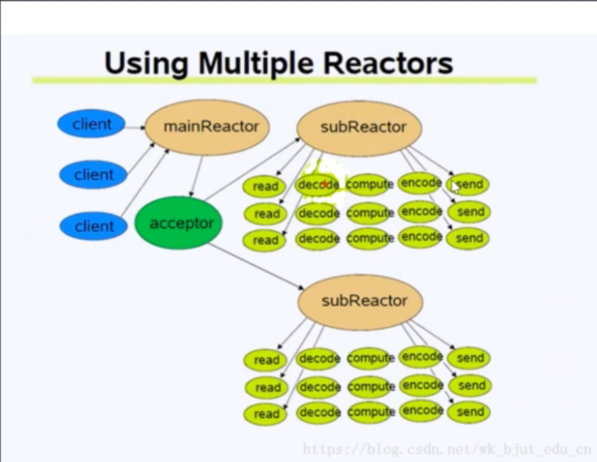
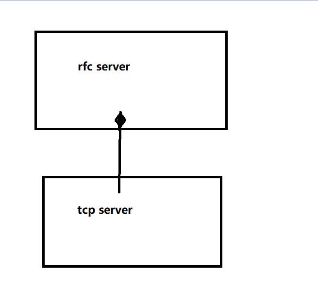

# MYMUDUO总结与使用



先上图。

1.首先，用户需要在主程序中创建一个baseLoop，然后要将这个baseLoop传递给建立的Server，建立的Server需要一个接口调用TcpServer类的start()用以开启subLoop(提前把线程数量写好)，

```cpp
int main()
{
    EventLoop loop; //创建baseLoop
    InetAddress addr(8000); //获取本地IP及端口用作Server
    EchoServer server(&loop,addr,"EchoServer-01");//创建EchoServer
    server.start();  //启动Accpetor,启动subReactor
    loop.loop();  //启动mainReactor
    return 0;
}
```


2.其次底层在TcpConnection类中有的读回调（TcpConnection::handleRead），写回调（TcpConnection::handleWrite()），Error回调(TcpConnection::handleError),Close回调(TcpConnection::handleClose )。 TcpConnection里面的回调帮我们做了很多核心，比如read和write就是由底层帮我们完成，我们只需要设置三个半回调，这三个半回调分别是和TcpConnection里的回调有关联，相应的会去执行他们。

我们需要传：

陈硕说过TCP网络编程最本质的处理是三个半事件

1.连接的建立

2.连接的断开

3.消息到达

3.5消息发送完毕


连接断开已经由底层帮我们维护，消息到达和消息发送的核心也是由底层帮我们做完，连接的建立也是如此。

我们要做的就是1.连接时可以需要提醒什么  2.消息到来时候我们应该怎么去处理这个消息  3.消息发送完毕后需要显示什么 4.多线程特点设置线程数量

```cpp
void setThreadInitcallback(const ThreadInitCallback &cb) //线程初始化回调
void setConnectionCallback(const ConnectionCallback &cb) //连接到来回调 
void setMessageCallback(const MessageCallback &cb)
    //消息到来回调
void setWriteCompleteCallback(const WriteCompleteCallback &cb)
    //消息发送完毕回调
```


##### TcpServer类接口：创建一个维护一个端口的服务类


tcpserver构造函数的语意就是选一个ipport作为监听端口与主loop绑定，并创建一个Acceptor与ipport对应的lfd绑定。

```cpp
TcpServer::TcpServer(EventLoop *loop,
                const InetAddress &listenAddr,
                const std::string &nameArg,
                Option option)
```


为cfd设置回调函数，设置完的回调函数将在acceptor分配之前完成设置。

```cpp
void setThreadInitcallback(const ThreadInitCallback &cb) 
    
    
void setConnectionCallback(const ConnectionCallback &cb) { connectionCallback_ = cb; }


void setMessageCallback(const MessageCallback &cb) { messageCallback_ = cb; } 
//设置读事件回调，当可读事件发生时，cfdchannel调用读回调，先从cfd中读取数据到input，若读写成功即if(n>0)则执行这个messagecallback回调。


void setWriteCompleteCallback(const WriteCompleteCallback &cb) { writeCompleteCallback_ = cb; }
```

**这几个函数具体执行表现在TcpConnection:handlerXXX中。**


设置线程数量即设置subloop数量

```cpp
void TcpServer::setThreadNum(int numThreads)
```


start()根据threadnum创建subloop。 一个tcpserver相当于一个主机的端口。同时将Acceptor对应的Channel上到主loop的Epoller中。

```cpp
void TcpServer::start()
```





##### TcpConnection类接口：

TcpConnection代表已经建立连接的客户端与服务端的一条链路，包含对端和本端的ip信息。由于cfd是由subLoop监听的，故TcpConnection建立后由subLoop联系索引。TcpConnection是直接设置cfdChannel的回调


**TcpConnection直接为cfd设置回调，故CfdChannel响应事件执行的函数是在TcpConnection类里面的handle族的。handleread就是读事件执行**

```cpp
对外接口public:
/* 属性类 */
bool connected(); //判断连接是否有效
EventLoop* getLoop();//获得主loop
const string& name(); //连接名字
const InetAddress& localAddress();  //本地InetAddress
const InetAddress& peerAddress(); //对端InetAddrss

    

/* 操作型 */
void shutdown(); //关闭连接
void send(string buf); //给对端（客户端）发送数据
void connectEstablished(); //连接建立，应该只能被调用1次，绑定channel与tcpconncection，启动感知epollin，将channel加到Poller中
void connectDestroyed(); //连接销毁，应该只能被调用1次,将对应的Channel从Poller中删掉


void setHighWaterMarkCallback(const HighWaterMarkCallback& cb, size_t highWaterMark)
    //由用户自己调用TcpConnection设置回调
    
void setWriteCompleteCallback(const WriteCompleteCallback& cb) //TcpServer会提供给用户相应接口设置该回调
    
void setMessageCallback(const MessageCallback& cb)
 //TcpServer会提供给用户相应接口设置该回调
    
void setConnectionCallback(const ConnectionCallback& cb)//TcpServer会提供给用户相应接口设置该回调
    
```

###### 注意点：

1.服务器都是先读请求，后回请求。所以Channel的写回调在写完之后还会继续判断`state_==kDisconnecting`（handlerwrite)连接是否关闭，若关闭就将连接从loop中移除。

2.服务端什么时候会有EPOLLOUT事件？当send的信息一次没有发送完，需要发第二次时就要将cfd置为epollout事件。

```cpp
sendinloop发送时的流程语意
//发送数据到cfd，第一次如果n<0且是EPIPE或ECONNRESET说明发生错误已经不能send但是如果不是这两个
//错误那么faultError=false,那么进入!faultError && remaining > 0 支流。
//如果第一次n>0则发送成功，但是可能没发完，如果remaing>0 && !faultError说明第一次没发送完或第一次被
//中断打断等原因，那么将数据放入output缓冲区，cfd置为epollout。当cfd可写时cfdchannel自动调用handlewrite将缓冲区数据发送到cfd ,发送完后将channel关闭感知epollout事件
```


3.Channel的回调指向的函数就是TcpConnection::handlerXXX

4.Channel弱绑定TcpConnection

5.shutdown（）关闭连接时调用shutdowninLoop()，其保证了outputbuffer数据能够全部发送给cfd才关闭。


##### Buffer类接口

```cpp
ssize_t Buffer::readFd(int fd, int* saveErrno);
//从cfdChannel->fd中读取数据到input中。置位了我们不用管，底层自动维护
    
ssize_t Buffer::writeFd(int fd, int* saveErrno);
//发送output缓冲区数据到fd。没置位我们不用管，底层自动维护


void retrieve(size_t len);
//已经取出了len，现在通过这个函数将readidx(firstidx)置位

void retrieveAll()
//已经全部取完了,重置firstidx与secondidx位初始值表示缓冲区已经清空
    
std::string retrieveAsString(size_t len);
//取出出来len并保存在一个string中，并置位。
    
std::string retrieveAllAsString();
//全部取出保存在string,并重置。

void ensureWriteableBytes(size_t len);
//判断缓冲区是否可写len,（经过挪位），如果挪位还不够就makeSpace(len) 扩容len


void append(const char *data, size_t len);
//先ensureWriteableBytes,然后copy [date to date+len]到缓冲区，再置位。


char* beginWrite()
//可写的位置。
    
    
static const size_t kCheapPrepend = 8;
static const size_t kInitialSize = 1024; //缓冲区默认大小
```

采用iovc内存碎片方法进行存储.   从cfd中取出数据到input缓冲区，若不够则将不够的部分放到栈中的空间，等全部从cfd中取完，将栈中的那部分全部append到inputbuffer中，append时有这样的抉择即如果将buffer里面的位置通过挪动够的话那么直接挪，不够的话就开辟新空间。这样做到inputbuffer大小刚好够。 整个过程自动把writeIndex置位。


其次，注意取出是双向的。从cfd到缓冲区，缓冲区到cfd都是取出


